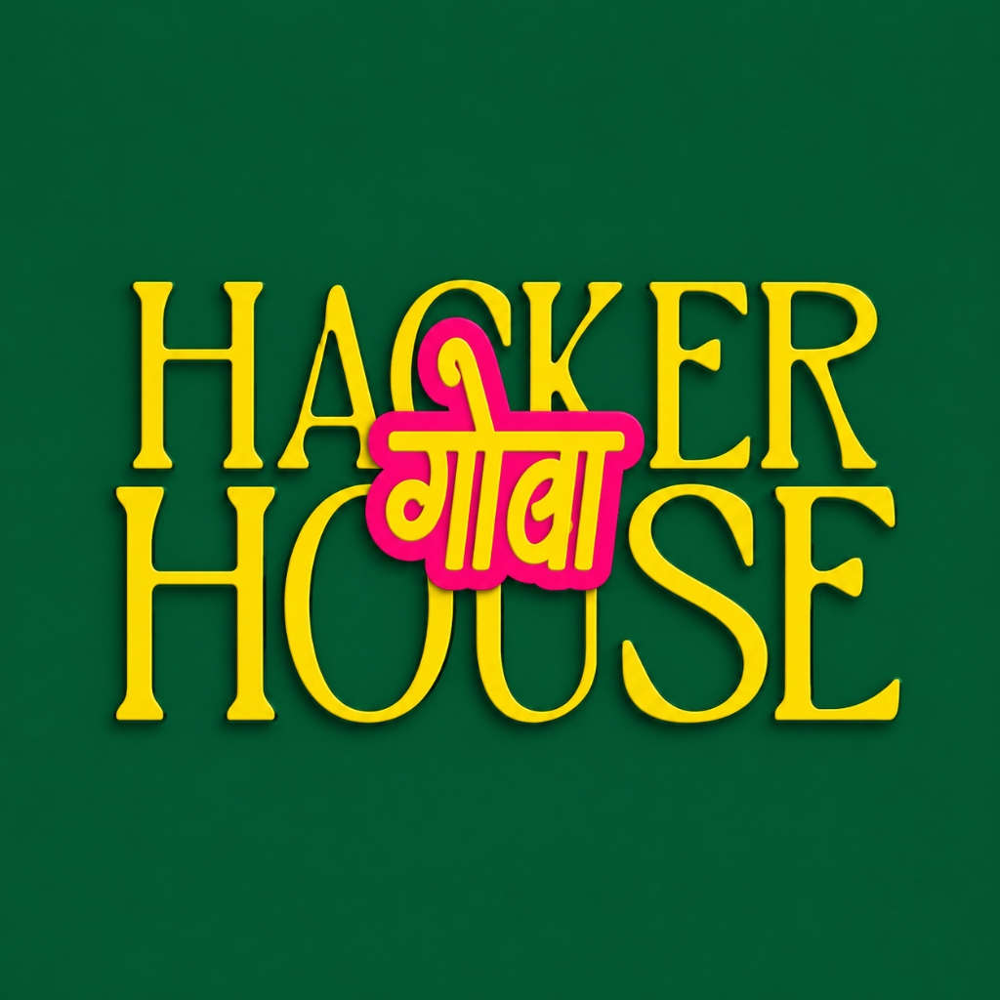

<div align="center">

  

  # HACKER HOUSE GOA 2026
  ### BUILDER IDENTITY & PFP FRAME GENERATOR

  [](https://react.dev/)
  [](https://www.typescriptlang.org/)
  [](https://vitejs.dev/)
  [](https://tailwindcss.com/)
  [](LICENSE)

  <p align="center">
    <strong>Turn your photo into your official Hacker House Goa 2026 builder identity. Generate crisp PFP frames & collectible digital Builder ID passes in seconds.</strong>
  </p>

  <p align="center">
    <a href="#-key-features">Key Features</a> •
    <a href="#-tech-stack">Tech Stack</a> •
    <a href="#-quick-start">Quick Start</a> •
    <a href="#-project-structure">Project Structure</a> •
    <a href="#-deployment">Deployment</a>
  </p>

</div>

---

## ⚡ Executive Summary

**Hacker House Goa 2026 — Builder Identity Generator** is an ultra-premium, 100% client-side web application designed to generate high-DPI social profile frames and collectible digital event passes for builders attending Hacker House Goa 2026.

Built with **React 19**, **TypeScript**, **Vite 6**, **Tailwind CSS v4**, and an in-browser **HTML5 Canvas rendering engine**, it provides **0ms network latency**, **complete data privacy**, and **retina-ready PNG downloads**.

---

## 🔥 Key Features

- 🎨 **Official Hacker House Goa Visual Identity**:
  - Deep Emerald Green (`#023826`), Solar Gold (`#FFE600`), and Electric Hot Pink (`#FF007A`).
  - Official brand logo integration & crisp English typography.

- 🖼️ **Dual High-DPI Output Formats**:
  1. **PFP Frame Overlay (1080 × 1080)**: Optimized for X (Twitter), Discord, and Telegram avatars.
  2. **Executive Builder ID Pass (1080 × 1350)**: Collectible event pass with structured metadata grid (`LOCATION`, `ACCESS LEVEL`, `PASS SERIAL`) & security barcode.

- 🎛️ **Interactive Photo Canvas Editor**:
  - Drag-to-pan preview positioning (`X/Y` offsets).
  - Smooth zoom slider (`0.5x` to `2.5x`).
  - Works with **JPG**, **PNG**, **WebP**, and **HEIC** (iPhone native photos).

- 🔒 **100% Client-Side & Private**:
  - Zero backend server or database required.
  - User photos never leave the browser.

- 📱 **Mobile & Touch Optimized**:
  - Fully responsive glassmorphism UI with smooth micro-animations.

- 📤 **One-Click X (Twitter) Sharing**:
  - Pre-filled share intent featuring `#FrameInGoa` hashtag.

---

## 🛠️ Tech Stack

| Technology | Purpose |
| :--- | :--- |
| **React 19** | Core UI Component Framework |
| **TypeScript** | Type-safe development with 0 strict errors |
| **Vite 6 (SWC)** | Ultra-fast HMR and production bundler |
| **Tailwind CSS v4** | Custom design tokens & emerald glassmorphism styling |
| **HTML5 Canvas API** | High-DPI graphics rendering engine |
| **heic2any** | In-browser HEIC to JPEG conversion |

---

## 🚀 Quick Start

### Prerequisites
- [Node.js](https://nodejs.org/) (v18.0 or higher)
- `npm` or `pnpm` or `yarn`

### Installation & Local Setup

1. **Clone the repository**:
   ```bash
   git clone https://github.com/Dev0ps404/HackerHouse-Goa-2026.git
   cd HackerHouse-Goa-2026
   ```

2. **Install dependencies**:
   ```bash
   npm install
   ```

3. **Start the local development server**:
   ```bash
   npm run dev
   ```
   Open `http://localhost:5173` in your browser.

4. **Build for production**:
   ```bash
   npm run build
   ```

---

## 📁 Project Structure

```
HackerHouse-Goa-2026/
├── public/
│   ├── favicon.svg
│   └── hhgoa-logo.jpg           # Official Hacker House Goa Logo
├── src/
│   ├── components/
│   │   ├── Header.tsx           # Floating brand navigation bar
│   │   ├── Hero.tsx             # Interactive showcase hero section
│   │   ├── HowItWorks.tsx       # Process walkthrough cards
│   │   ├── UploadZone.tsx       # Photo upload dropzone (JPG/PNG/HEIC)
│   │   ├── FormatSelector.tsx   # Format switcher (PFP vs Builder ID)
│   │   ├── IdentityForm.tsx     # Builder details & title generator input
│   │   ├── ImageEditor.tsx      # Zoom slider & directional pan controls
│   │   ├── Preview.tsx          # Real-time interactive canvas preview
│   │   ├── GenerateButton.tsx   # Generation trigger button
│   │   ├── DownloadButton.tsx   # High-DPI PNG exporter
│   │   ├── ShareXButton.tsx     # X share intent handler
│   │   ├── ResultView.tsx       # Final generated result view
│   │   ├── Toast.tsx            # Floating notification stack
│   │   └── Footer.tsx           # Event footer & branding
│   ├── hooks/
│   │   └── useImageProcessor.ts # State & image processing hook
│   ├── lib/
│   │   ├── canvas.ts            # High-DPI Canvas Rendering Engine
│   │   ├── builderTitles.ts     # Deterministic title generator
│   │   └── xShare.ts            # X share intent helper
│   ├── App.tsx                  # Root layout component
│   ├── index.css                # Emerald design system & Tailwind setup
│   └── main.tsx                 # React entry point
├── index.html                   # HTML entry point with metadata
├── package.json
└── vite.config.ts
```

---

## 🌐 Deployment

This application is **static** and can be deployed for free in 30 seconds to any hosting provider:

### Vercel / Netlify
1. Connect your GitHub account to [Vercel](https://vercel.com) or [Netlify](https://netlify.com).
2. Import `Dev0ps404/HackerHouse-Goa-2026`.
3. Set build command: `npm run build` (Output Directory: `dist`).
4. Click **Deploy**.

---

## 📄 License

Distributed under the **MIT License**. See `LICENSE` for more information.

---

<div align="center">
  <sub>Built for <strong>Hacker House Goa 2026</strong> · #FrameInGoa</sub>
</div>
